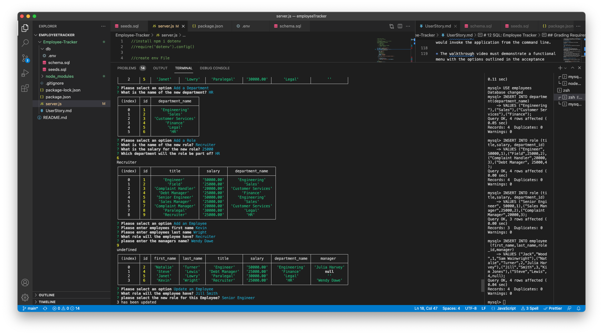

# Employee Tracker
  
  
  ## Description
  
   This is a node application that allows management of employee data. It was built using inquirer and MySQL. Please refer to the video walk through demo: https://watch.screencastify.com/v/04uUJ3P9tfS5qpMtyxyn

  
   
  ## Table of Contents
  * [Installation](#installation)
  * [Usage](#usage)
  * [License](#license)
  * [Contributing](#contributing)
  * [Tests](#tests)
  * [Questions](#questions)
  
  ## Installation
  npm i
  ## Usage
  To start the application run node server.js, then select from the list options - each view option will display that department, role or employee table. The user can also add departments, roles and employees.
  ## License
  https://opensource.org/licenses/MIT
  This project is under the license of MIT
  ## Contributing 
  Please get in touch if you want to contribute
  ## Tests
  npm run test
  ## Questions
  If you have any questions about this project, you can contact me at matthewmckenna1986@hotmail.com. More projects available here https://github.com/mattmc86.

